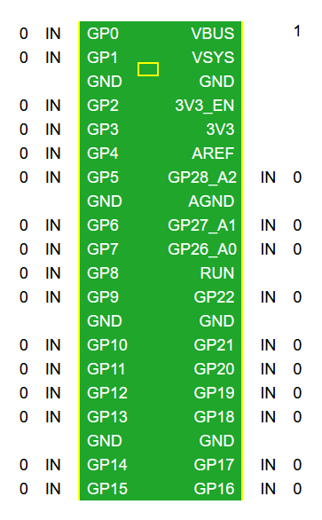

# Raspberry Pi Pico W GPIO Dashboard #

## About

Monitoring and changing the state of the pins of [Raspberry Pi Pico W](https://www.raspberrypi.com/products/raspberry-pi-pico/) from a simple web interface.

## Installation

Connect Pico to PC and [install MicroPython](https://picockpit.com/raspberry-pi/raspberry-pi-pico-and-micropython-on-windows).

Open main.py from this repository with text editor and enter name and password of your wifi network.

Copy main.py and index.htm into Pi Pico.

## Using

After restarting pico will run main.py from its memory. The LED will blink while connecting to wifi, it will go off at successful connection.

You have to determine the IP address of the device. You can see it in the wifi router settings or in the Thonny's "Shell" panel if it is connected to the board. Open this address with your browser. The device on which the browser is running must be connected to the same wifi network. You will see page with current pins states:

* Click the mode (IN/OUT/ADC) to change it.
* If mode is OUT click the value (0/1) to toggle it.
* Click the yellow rectange to toggle onboard LED.
